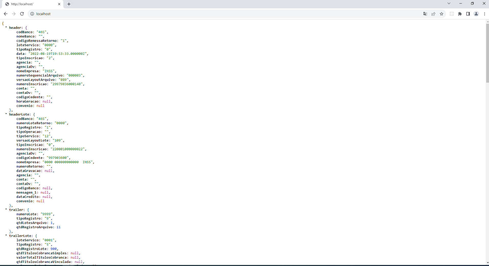
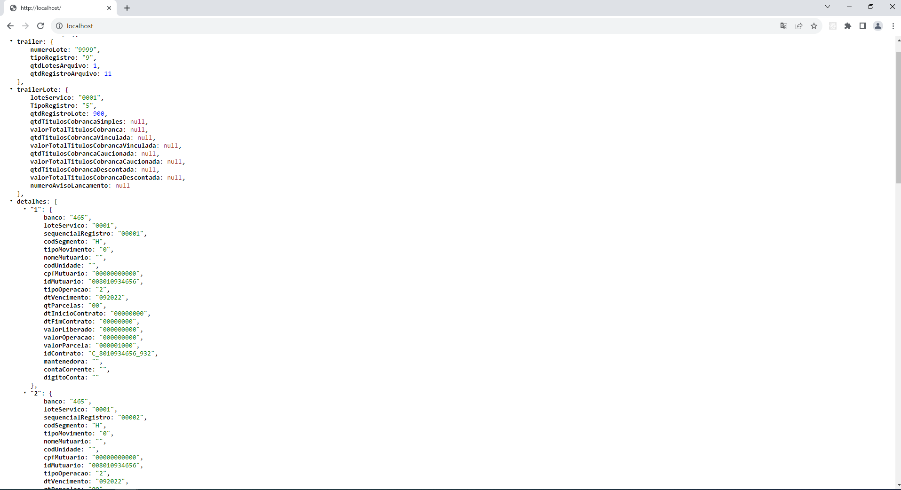

# Arquivo CNAB

Demonstração em JSON da leitura de um arquivo CNAB.




## Requisitos

Antes de iniciar, certifique-se de ter os seguintes requisitos instalados em sua máquina:

-   **PHP >= 8.2.9**
-   **Composer** ([https://getcomposer.org/](https://getcomposer.org/))
-   **Laravel 10** ([https://laravel.com/docs/10.x/installation))


## Passos para Execução

Siga as etapas abaixo para configurar e executar o projeto:

1.  **Clone o repositório:**

    ```bash
    git clone https://github.com/KathrynOliveira/web-cnab.git
    cd web-cnab
    ```

2.  **Crie o arquivo .env:**

    Copie o arquivo .env.example para .env e configure as informações de conexão com o banco de dados.

    ```bash
    cp .env.example .env
    ```

3.  **Instale as dependências do Laravel:**

    ```bash
    composer install
    ```

4.  **Execute as migrações do banco de dados:**

    ```bash
    php artisan migrate
    ```

5.  **Execute as Seeders:**

    ```bash
    php artisan db:seed
    ```

6.  **Inicie o servidor de desenvolvimento:**

    ```bash
    php artisan serve
    ```

    O servidor de desenvolvimento será executado em http://localhost:8000.

7.  **Acesse a aplicação no navegador:**

    Abra seu navegador e acesse http://localhost:8000. Você verá a página inicial da aplicação.

## Usando Laravel Sail (opcional)

Laravel Sail é uma ferramenta que fornece um ambiente de desenvolvimento Docker para aplicativos Laravel. Se você preferir usar o Laravel Sail para executar o projeto, siga os passos abaixo:

**Inicie o ambiente com Laravel Sail (Docker):**

```bash
./vendor/bin/sail up -d
```

**Execute as migrações do banco de dados:**

```bash
./vendor/bin/sail artisan migrate
```

## Autora

Kathryn Oliveira
